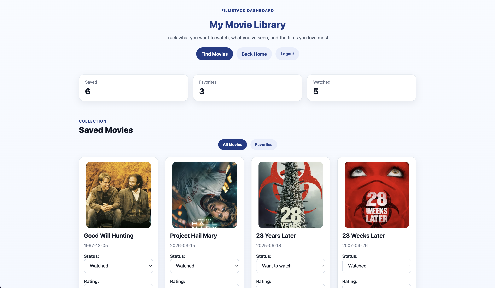
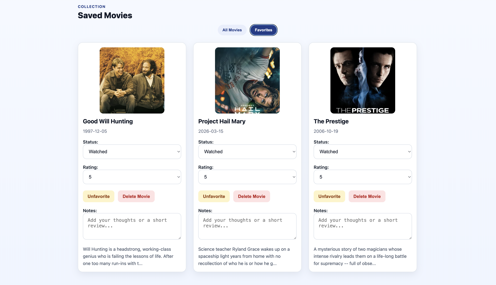
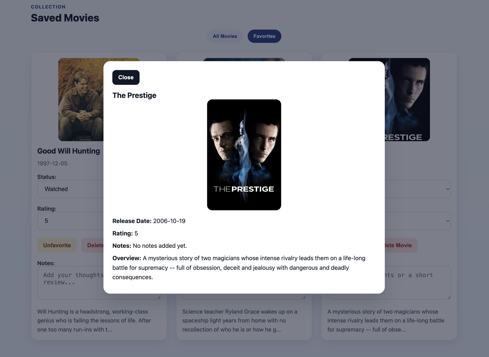

# FilmStack
FilmStack is a movie tracking app build with Next.js. It lets users create an account, search for movies, save titles to a personal library, save favorites, rate movies, update watch status, and add personal notes.

## Features
- User authentication 
- Movie search powered by an API route (TMDB)
- Personal dashboard for saved movies
- Favorite filtering
- Movie status tracking (Want to Watch, Watched, Owned)
- Personal ratings and notes for each saved title
- Responsive layout across all pages

## Tech Stack
- Next.js
- React
- CSS Modules
- Iron Session
- Node.js
- Vercel for deployment

## Pages
- Home: landing page with app overview and account actions
- Search: search for movies and seve them to your library
- Dashboard: manage saved movies, favorites, ratings, notes, and status

## Getting Started
1. Clone the resository
```
git clone https://github.com/rptea/filmstack-teano.git
cd filmstack-teano
```
2. Install dependencies
```
npm install
```
3. Add environmental variables
Create a `.env.local` file in the root of the project and add the required variables.
Example: 
```
TMDB_API_TOKEN=your_tmdb_api_token
SESSION_SECRET=your_session_secret
MONGODB_URI=your_mongodb_connection_string
```
- Update the variable names if your project uses different ones.

4. Run the development server
```
npm run dev
```
- Open http://localhost:3000 in your browser.

## Project Structure
```
filmstack-teano/
- components/
- config/
- hooks/
- pages/
- public/
- styles/
- .env.local
- package.json
- README.md
```

## Deployment
FilmStack is set up to deploy well on Vercel.
1. Push the project to GitHub.
2. Log in to Vercel and import the `filmstack-teano` repository.
3. Confirm the Next.js project settings that Vercel auto-detects.
4. Add the same environment variables used in `.env.local` to the vercel project settings before deploying.
5. Deploy and use the generated production URL from the Vercel dashboard.

## Screenshots

### Dashboard View


### Favorites List


### Movie Card View
